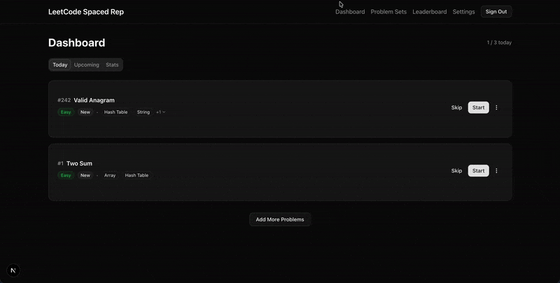
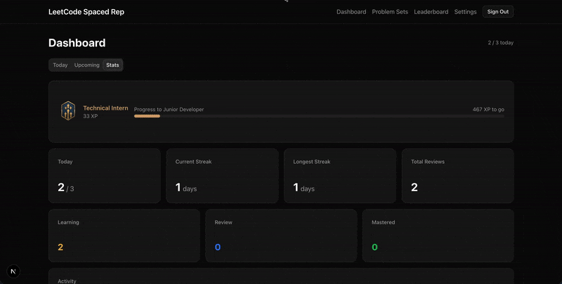
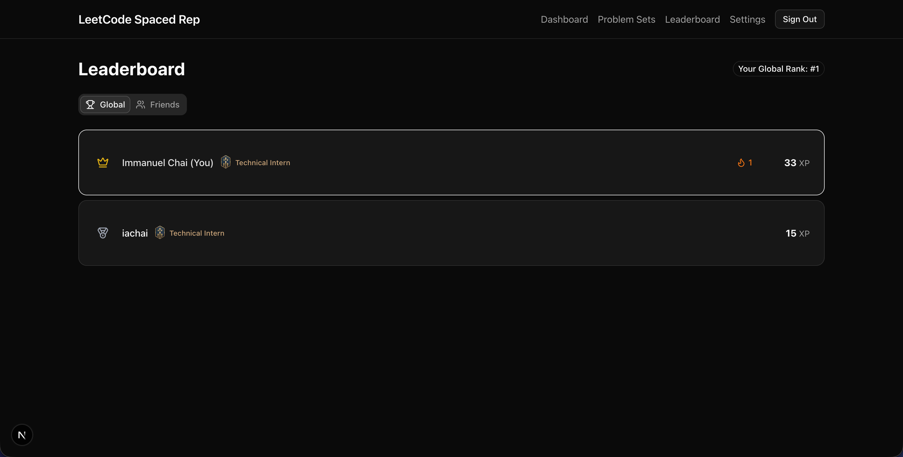

# LeetCode Spaced Repetition

A web app that applies the **SM-2 spaced repetition algorithm** to LeetCode practice. Stop grinding randomly — review problems at scientifically optimal intervals based on your performance.

[Live Demo](https://leetcode-spaced-rep.vercel.app/) · [Report Bug](https://github.com/yourusername/leetcode-spaced-rep/issues)

<p align="center">
  
  
</p>

<p align="center">
  
  
</p>

## Features

- **Smart Scheduling** — SM-2 algorithm calculates optimal review intervals based on your ratings (Again/Hard/Medium/Easy)
- **Curated Problem Sets** — Start with NeetCode 150 or LeetCode 75, or create custom sets
- **Progress Tracking** — See problems in Learning, Review, or Mastered states
- **XP & Ranks** — Earn XP for reviews with streak bonuses, climb from Technical Intern to LeetCode Legend
- **Streak System** — Daily streak tracking with celebration modals
- **Activity Heatmap** — GitHub-style contribution graph for your review history
- **Leaderboard** — Compare progress with friends via friend codes
- **Guest Mode** — Try the app before signing in

## Tech Stack

| Layer      | Technology                       | Why                                     |
| ---------- | -------------------------------- | --------------------------------------- |
| Framework  | **Next.js 14** (App Router)      | Server components, API routes, great DX |
| Database   | **Supabase** (PostgreSQL)        | Auth, real-time, Row Level Security     |
| Auth       | **Google OAuth**                 | Simple, secure, no password management  |
| Styling    | **Tailwind CSS** + **shadcn/ui** | Rapid UI development, consistent design |
| Deployment | **Vercel**                       | Zero-config Next.js hosting             |

## How SM-2 Works

The [SM-2 algorithm](https://en.wikipedia.org/wiki/SuperMemo#Description_of_SM-2_algorithm) adjusts review intervals based on how well you remembered:

| Rating     | Effect                                            |
| ---------- | ------------------------------------------------- |
| **Again**  | Reset to 1 day, decrease ease factor              |
| **Hard**   | Interval × 1.2, ease factor -= 0.15               |
| **Medium** | Interval × ease factor                            |
| **Easy**   | Interval × ease factor × 1.3, ease factor += 0.15 |

A problem is **Mastered** when: interval ≥ 30 days AND last rating was Easy/Medium.

## Getting Started

### Prerequisites

- Node.js 18+
- A Supabase project ([create one free](https://supabase.com))
- Google OAuth credentials ([setup guide](https://supabase.com/docs/guides/auth/social-login/auth-google))

### Installation

```bash
# Clone the repository
git clone https://github.com/yourusername/leetcode-spaced-rep.git
cd leetcode-spaced-rep

# Install dependencies
npm install

# Set up environment variables
cp .env.example .env.local
```

Add your Supabase and Google credentials to `.env.local`:

```env
NEXT_PUBLIC_SUPABASE_URL=your_supabase_url
NEXT_PUBLIC_SUPABASE_ANON_KEY=your_anon_key
GOOGLE_CLIENT_ID=your-google-client-id
GOOGLE_CLIENT_SECRET=your-google-client-secret
```

### Database Setup

```bash
# Start local Supabase (optional, for local dev)
npx supabase start

# Push schema to your Supabase project
npx supabase db push

# Generate TypeScript types
npx supabase gen types typescript --local > src/types/database.ts
```

### Run Development Server

```bash
npm run dev
```

Open [http://localhost:3000](http://localhost:3000).

## Project Structure

```
src/
├── app/                    # Next.js App Router
│   ├── api/               # API routes
│   │   ├── problems/      # Queue, upcoming problems
│   │   ├── review/        # Submit ratings
│   │   ├── stats/         # User statistics
│   │   └── ...
│   ├── dashboard/         # Main review interface
│   ├── leaderboard/       # Global & friends rankings
│   └── settings/          # User preferences
├── components/            # React components
│   ├── ui/               # shadcn/ui primitives
│   ├── problem-card.tsx  # Problem display
│   ├── rating-modal.tsx  # Post-review rating
│   └── ...
├── lib/
│   ├── sm2.ts            # SM-2 algorithm implementation
│   ├── xp.ts             # XP & rank calculations
│   └── supabase/         # Database client
└── types/                # TypeScript definitions
```

## Key Implementation Details

- **Row Level Security (RLS)** on all user tables — users can only access their own data
- **Timer auto-starts** when opening LeetCode, caps at 60 minutes
- **Due problems prioritized** by urgency (most overdue first)
- **Session storage** for daily targets — persists during navigation, resets each session

## Scripts

```bash
npm run dev      # Start development server
npm run build    # Production build
npm run lint     # Run ESLint
```

## Contributing

Contributions are welcome! Please read `CLAUDE.md` for architecture details and development context.

## License

MIT

---

Built by [Immanuel Chai](https://github.com/iachai02)
